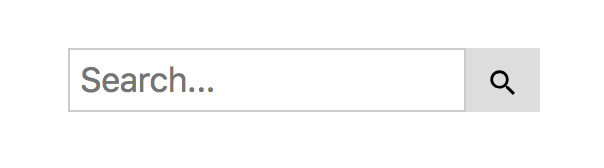

# React-js-search
React JS Search

# Description

Really simple search component, plug and play where you define two callbacks that are triggered when the search text has changed or when the user clicks on the search button. It will trigger back the defined function with the typed String and found objects (optional) as param so you can filter a table, call your backend, etc. 

# How it looks



# Installation

Install it from npm and include it in your React build process (using Webpack, Browserify, etc).

```
npm i react-js-search
```

# Usage

Import `SearchBar` in your react component.

```javascript
import SearchBar from 'react-js-search';
```

You can pass an array of objects where you want to look data for, for instance:

```jacascript
[ 
  {number: 12, name:"Buffon", position: "ST", success: true},
  {number: 21, name: "Pirlo", position: "MC", success: false},
  {number: 10, name: "Ruiz", position: "MDI"},
  {number: 7, name: "Nesta", position: "RB", success: true},
  {number: 4, name: "Cannavaro", position: "CB"},
  {number: 2, name: "Puyol", position: "CB", success: false},
  {number: 15, name: "Abate", position: "LB"},
  {number: 16, name: "Locatelli", position: "MDI"},
  {number: 1, name: "Buffon", position: "GK"},
  {number: 21, name: "Pirlo", position: "MC"},
  {number: 10, name: "Ruiz", position: "MDI"},
  {number: 7, name: "Nesta", position: "RB"}
]
```

When the user do a search of a term the string typed will be used as haystack and data passed as prop will be used for the search. The search will be done looking at all values in object and will return the term search used and an array of objects that had a hit.


For example:
```javascript
<SearchBar 
	onSearchTextChange={ (term,hits) => {this.onSearchChange(term,hits)}}
	onSearchButtonClick={this.onSearchClick}
	placeHolderText={"Search here..."}
data={this.state.dataObjects}
/>
```

# Props

| Name        | Type            | Mandatory | Description 
| ------------- |:-------------:| -----:|:-----|
| onSearchTextChange      | function | Y | Function to call back when the input text change |
| onSearchButtonClick | function     | Y| Function to call back when the search button is pressed |
| placeholder | String   |N  | Default: 'Search...', Place holder text for the textfield |
| data | Array |N| An array of objects that will be used to search stuff (if not passed, function will trigger back the term searched)| 
| caseInsensitive | boolean |N| do searches without casing| 


# What's new

v0.2.4
* new case insensitve search

v0.2.1
* Search CSS isolation

v0.2.0
* Search bar searches through an array of objects and returns the ones that were found.


# License 

Licensed under the MIT License © [jciccio](https://www.npmjs.com/~jciccio)
